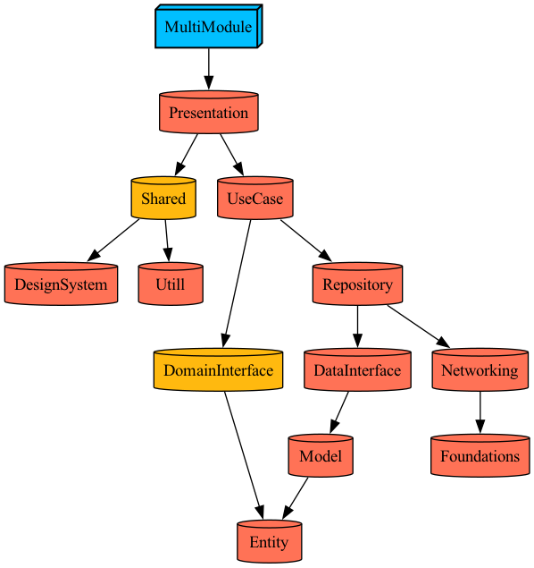

# MultiModuleTemplate

NomadSpot-iOS와 동일한 구조를 갖춘 Tuist 멀티 모듈 iOS 프로젝트 템플릿입니다.

## 🏗️ 프로젝트 구조 (Clean Architecture)

```
MultiModuleTemplate/
├── Workspace.swift
├── Tuist.swift
├── Projects/
│   ├── App/                    # 메인 애플리케이션
│   ├── Presentation/
│   │   └── Presentation/       # 화면 및 ViewModel 구성
│   ├── Domain/                 # 🔥 도메인 계층 (비즈니스 로직 + Protocol)
│   │   ├── Entity/             # 도메인 엔티티 + Entity Protocol
│   │   ├── UseCase/            # 비즈니스 로직 + UseCase Protocol
│   │   ├── DomainInterface/    # Domain 계층 인터페이스 모듈
│   │   └── DataInterface/      # Data 계층 인터페이스 모듈
│   ├── Data/                   # 데이터 계층 (데이터 접근 + Model)
│   │   ├── Model/              # 데이터 전송 객체 (DTO, API Response)
│   │   ├── Repository/         # Repository 구현체 (Domain Protocol 구현)
│   │   ├── API/                # REST API 클라이언트
│   │   └── Service/            # 데이터 처리 서비스
│   ├── Network/                # 네트워크 계층
│   │   ├── Networking/         # 네트워크 기본 설정 및 클라이언트
│   │   ├── Foundations/        # 네트워크 기반 유틸리티
│   │   └── ThirdPartys/        # 네트워크 써드파티 라이브러리 (AsyncMoya, WeaveDI)
│   └── Shared/
│       ├── DesignSystem/       # 공통 UI 컴포넌트, 폰트 등
│       ├── Shared/             # 공통 공유 모듈
│       └── Utill/              # 공통 유틸리티
├── Tuist/
│   ├── Package.swift
│   └── ProjectDescriptionHelpers/
└── Plugins/
```

## Tuist graph


## ✨ 주요 특징

- **AsyncMoya 네트워크 통신**: 최신 비동기 네트워킹
- **TCA SharedState**: 앱 전역 상태 관리
- **Clean Architecture**: Domain 중심 의존성 설계
- **Tuist 4.97.2 최적화**: 최신 빌드 시스템

## 🚀 빠른 시작

### 새 프로젝트 생성 (권장)

```bash
# 1. TuistTool 컴파일 (최초 1회만)
swiftc TuistTool.swift -o tuisttool

# 2. 새 프로젝트 생성 (대화형으로 이름 설정)
./tuisttool newproject
```

### 템플릿 그대로 사용

```bash
# Tuist 4.97.2 최신 명령어
tuist install     # 의존성 설치 (새로운 명령어)
tuist generate    # 프로젝트 생성
tuist build       # 빌드
tuist test        # 테스트

# 또는 TuistTool 사용 (권장)
./tuisttool build # clean + install + generate 한번에
```

## 주요 모듈 설명

### 📱 Application Layer
- **App**: 메인 애플리케이션 모듈 (앱 진입점 및 설정)
- **Presentation**: ViewController, ViewModel 등 UI 로직 담당

### 🏗 Domain Layer (비즈니스 로직 + Protocol)
- **Entity**: 순수 도메인 엔티티 + Entity 관련 Protocol
- **UseCase**: 비즈니스 로직 구현체 + UseCase Protocol
- **DomainInterface**: Domain Entity를 참조하는 인터페이스 모듈
- **DataInterface**: Data Model을 참조하는 인터페이스 모듈

### 📊 Data Layer (데이터 접근 + Model)
- **Model**: DTO 구현체 (Domain Entity로 변환 기능 포함)
- **Repository**: Repository 구현체 (Domain Protocol 구현)
- **API**: REST API 클라이언트 및 Endpoint 정의
- **Service**: 데이터 처리 서비스 (캐싱, 변환 등)

### 🌐 Network Layer
- **Networking**: 네트워크 기본 설정 및 HTTP 클라이언트
- **Foundations**: 네트워크 기반 유틸리티
- **ThirdPartys**: 네트워크 관련 써드파티 라이브러리 (AsyncMoya, WeaveDI)

### 🎨 Shared Layer
- **DesignSystem**: 공통 UI 컴포넌트, 폰트, 색상 등 디자인 시스템
- **Shared**: 공통 공유 모듈 및 기본 설정
- **Utill**: 날짜, 문자열, 로깅 등 공용 유틸리티

### 🔄 의존성 방향 (Clean Architecture)
```
Presentation → Domain (UseCase Protocol)
       ↓
Domain/UseCase → Domain (Repository Protocol)
       ↓
Data/Repository → Domain (Entity + Repository Protocol)
       ↓
Data/Model → Domain (Entity 변환)
```

## 개발 환경

- iOS 17.0+
- Xcode 26.0.1+
- Swift 6.0+
- **Tuist 4.97.2** (최신 최적화 적용)

## 사용 라이브러리

- **ComposableArchitecture**: 상태 관리 및 아키텍처
- **AsyncMoya**: 비동기 네트워크 통신
- **WeaveDI**: 의존성 주입
- **TCACoordinators**: TCA 기반 네비게이션
- **swift-sharing (TCA SharedState)**: TCA 상태 공유

## ⚡ Tuist 4.97.2 최적화

이 템플릿은 **Tuist 4.97.2**의 최신 기능들을 완전히 활용하여 최적화되었습니다:

### 🚀 **성능 최적화**
- **새로운 `install` 명령어**: `fetch` 대신 더 빠르고 안정적인 의존성 관리
- **바이너리 캐시**: 의존성을 framework로 설정하여 빌드 캐시 활용
- **Swift 6.0 지원**: 최신 Swift 언어 기능 및 성능 개선

### 🔍 **새로운 분석 도구**
- **`tuist inspect implicit-imports`**: 암시적 의존성 자동 검사
- **`tuist inspect code-coverage`**: 코드 커버리지 분석
- **정적 부작용 경고**: 잠재적 의존성 문제 사전 감지

### 📋 **최신 API 사용**
- **Tuist.swift**: 새로운 설정 파일 형식 (`Config.swift` → `Tuist.swift`)
- **Package.swift**: 최적화된 패키지 설정 및 성능 향상
- **Settings API**: 최신 타입 안전 설정 방식

## 🏗 Clean Architecture 설계

### 🎯 Domain 중심 설계

이 프로젝트는 **Domain 계층에 Protocol과 구현을 통합**하여 Clean Architecture를 구현합니다:

#### 📋 Domain Layer (Protocol + Entity + UseCase)
```swift
// Domain/Entity/User.swift
public struct User {
    public let id: String
    public let name: String
    public let email: String

    public init(id: String, name: String, email: String) {
        self.id = id
        self.name = name
        self.email = email
    }

    // 비즈니스 로직
    public var displayName: String {
        return name.isEmpty ? "Unknown User" : name
    }
}

// Domain/Repository/UserRepository.swift
public protocol UserRepository {
    func fetchUser(id: String) async throws -> User
    func saveUser(_ user: User) async throws
}

// Domain/UseCase/GetUserUseCase.swift
public protocol GetUserUseCase {
    func execute(id: String) async throws -> User
}

public final class GetUserUseCaseImpl: GetUserUseCase {
    private let repository: UserRepository

    public init(repository: UserRepository) {
        self.repository = repository
    }

    public func execute(id: String) async throws -> User {
        return try await repository.fetchUser(id: id)
    }
}
```

#### 🏗️ Data Layer (Model + Repository 구현)
```swift
// Data/Model/UserModel.swift
import Domain

public struct UserModel: Codable {
    public let user_id: String
    public let user_name: String
    public let user_email: String

    // ✅ Model → Entity 변환 (Data가 Domain 의존)
    public func toEntity() -> User {
        return User(
            id: user_id,
            name: user_name,
            email: user_email
        )
    }
}

// Data/Repository/UserRepositoryImpl.swift
import Domain

public final class UserRepositoryImpl: UserRepository {
    private let apiService: APIService

    public init(apiService: APIService) {
        self.apiService = apiService
    }

    public func fetchUser(id: String) async throws -> User {
        let model: UserModel = try await apiService.fetchUser(id: id)
        return model.toEntity()  // Model → Entity 변환
    }
}
```

### 💡 핵심 장점

#### 1. **Domain 중심 의존성**
```
✅ Domain 통합 방식:
Presentation → Domain (Protocol + Entity)
       ↓
Data → Domain (Protocol 구현 + Entity 사용)

모든 계층이 Domain을 중심으로 의존
```

#### 2. **응집도 향상**
```swift
// 관련 Protocol과 구현이 같은 모듈에
// Domain/UseCase/GetUserUseCase.swift
public protocol GetUserUseCase {
    func execute(id: String) async throws -> User
}

public final class GetUserUseCaseImpl: GetUserUseCase {
    // 구현체도 같은 파일에
}
```

#### 3. **테스트 용이성**
```swift
// Mock 구현이 매우 간단
final class MockUserRepository: UserRepository {
    func fetchUser(id: String) async throws -> User {
        return User(id: "mock", name: "Mock User", email: "mock@test.com")
    }
}

// 테스트에서 쉽게 사용
let mockRepo = MockUserRepository()
let useCase = GetUserUseCaseImpl(repository: mockRepo)
let user = try await useCase.execute(id: "test")
```

#### 4. **단순한 구조**
- **Domain**: Protocol + Entity + UseCase 통합 관리
- **Data**: Domain Protocol 구현 + Model 변환
- **모듈 수 감소**: Interface 별도 모듈 불필요

---

# 🛠️ TuistTool (커스텀 CLI)

프로젝트 전용 CLI 도구입니다. Tuist 명령을 래핑하고, 새 프로젝트 생성, 모듈 스캐폴딩 등을 지원합니다.

## 설치 및 사용법

```bash
# 컴파일
swiftc TuistTool.swift -o tuisttool

# 사용법
./tuisttool <command>
```

### 지원 명령어 요약

| Command       | 설명 |
|---------------|------|
| `newproject`  | **🚀 새 프로젝트 생성**: ProjectConfig.swift 이름 변경, 디렉토리 자동 생성, 완전 자동화된 프로젝트 생성 |
| `generate`    | `tuist generate` 실행 |
| `build`       | **clean → install → generate** 순서로 실행 (Tuist 4.97.2 최적화) |
| `install`     | **새로운!** `tuist install` 실행 (의존성 설치) |
| `clean`       | `tuist clean` 실행 |
| `cache`       | `tuist cache` 실행 (바이너리 캐시 생성) |
| `reset`       | **강력 클린**: 모든 캐시 삭제 후 `install → generate` 재실행 |
| `inspect`     | **새로운!** 사용 가능한 분석 도구 표시 |
| `inspect-imports` | **새로운!** 암시적 의존성 검사 |
| `inspect-coverage` | **새로운!** 코드 커버리지 분석 |
| `moduleinit`  | **모듈 스캐폴딩 마법사**: 자동 의존성 삽입 및 Interface 폴더 생성 |

### 상세 동작

- **newproject** (완전히 새로워짐!)
  - 🎯 **ProjectConfig.swift 자동 수정**: 프로젝트 이름, 번들 ID, 팀 ID 자동 변경
  - 📁 **필수 디렉토리 사전 생성**: MultiModuleTemplateTests, FontAsset 등 자동 생성
  - 🔍 **이름 변경 검증**: 변경 완료 후 실제로 적용되었는지 확인
  - 🧹 **기존 워크스페이스 정리**: 충돌 방지를 위한 기존 파일 삭제
  - ✅ **완전 자동화**: 대화형 또는 명령어 인자로 완전 자동 생성

- **build** (Tuist 4.97.2 최적화)
  - 내부적으로 `clean → install → generate` 호출 (`fetch` 대신 `install` 사용)

- **install** (새로운 명령어)
  - Tuist 4.97.2의 새로운 `tuist install` 명령어 실행
  - 의존성 설치 및 해결 담당

- **inspect 시리즈** (새로운 분석 도구들)
  - `inspect`: 사용 가능한 분석 도구 목록 표시
  - `inspect-imports`: 암시적 의존성 검사 (enforceExplicitDependencies 대체)
  - `inspect-coverage`: 코드 커버리지 분석

- **reset** (개선됨)
  - `~/Library/Caches/Tuist`, `~/Library/Developer/Xcode/DerivedData`, `.tuist`, `.build`, `Tuist/Dependencies` 삭제
  - 이후 `install → generate` 순차 실행 (최신 워크플로우)
- **moduleinit**
  - `Plugins/DependencyPlugin/ProjectDescriptionHelpers/TargetDependency+Module/Modules.swift`에서 **모듈 타입** 및 **케이스 목록**을 파싱합니다.
  - `Plugins/DependencyPackagePlugin/ProjectDescriptionHelpers/DependencyPackage/Extension+TargetDependencySPM.swift`에서 **SPM 의존성 목록**을 파싱합니다.
  - 입력 받은 의존성들을 `Projects/<Layer>/<ModuleName>/Project.swift`의 `dependencies: [` 영역에 자동 삽입합니다.
  - Domain 계층 생성 시, `Interface/Sources/Base.swift`를 템플릿으로 생성하도록 선택 가능.

> ⚠️ **파일 경로 전제**  
> - 위 파서는 특정 경로의 파일 구조/포맷을 기대합니다. 경로가 다르거나 파일 포맷이 변경되면 파싱이 실패할 수 있습니다.  
> - 경로가 다르다면 `availableModuleTypes()`, `parseModulesFromFile()`, `parseSPMLibraries()`의 파일 경로를 프로젝트에 맞게 수정하세요.

## 🚀 동적 프로젝트 이름 설정

"MultiModuleTemplate" 대신 원하는 이름으로 프로젝트를 생성할 수 있습니다.

### 사용 방법

#### 🎯 방법 1: TuistTool 사용 (권장)

```bash
# 대화형 입력
./tuisttool newproject

# 명령어 인자로 바로 설정
./tuisttool newproject MyAwesomeApp --bundle-id com.company.app
```

#### 🎯 방법 2: 환경변수 (CI/CD용)

```bash
export PROJECT_NAME="MyAwesomeApp"
export BUNDLE_ID_PREFIX="com.company.awesome"
tuist generate
```

#### 🎯 방법 3: Tuist 템플릿 (완전히 새 프로젝트)

```bash
mkdir MyNewProject && cd MyNewProject
tuist scaffold multi-module-project --name MyNewProject
```

### 설정 가능한 항목

| 항목 | 설명 | 기본값 |
|------|------|--------|
| `PROJECT_NAME` | 앱 이름 | MultiModuleTemplate |
| `BUNDLE_ID_PREFIX` | 번들 ID 접두사 | io.Roy.Module |
| `TEAM_ID` | 개발팀 ID | N94CS4N6VR |

---

## 🎯 자주 쓰는 명령어

### 새 프로젝트 생성
```bash
# 대화형 생성 (권장)
./tuisttool newproject

# 명령어로 한번에 생성
./tuisttool newproject MyApp --bundle-id com.company.myapp --team-id ABC123
```

### 기본 개발 워크플로우
```bash
# Tuist 4.97.2 최적화된 워크플로우
./tuisttool build      # clean → install → generate
./tuisttool test       # 테스트 실행

# 코드 품질 검사
./tuisttool inspect-imports    # 암시적 의존성 검사
./tuisttool inspect-coverage   # 코드 커버리지 분석
```

### 문제 해결
```bash
# 강력한 클린 (모든 캐시 삭제)
./tuisttool reset

# 의존성 재설치
./tuisttool install

# 프로젝트 구조 분석
tuist graph --format pdf --path ./graph.pdf
```

### 모듈 개발
```bash
# 새 모듈 생성 (자동 의존성 설정)
./tuisttool moduleinit

# 특정 모듈만 포커스
tuist focus <모듈명>
```

## 🔧 CI/CD 예시

### GitHub Actions (권장)
```bash
# CI 파이프라인
./tuisttool reset      # 모든 캐시 클린
./tuisttool build      # clean → install → generate
./tuisttool test       # 테스트 실행
./tuisttool inspect-imports  # 의존성 검증
```

### 로컬 재현
```bash
# CI와 동일한 환경에서 로컬 테스트
./tuisttool reset && ./tuisttool build && ./tuisttool test
```

---

## 기여 방법

1. 브랜치를 생성합니다 (`git checkout -b feature/my-feature`)  
2. 변경사항을 커밋합니다 (`git commit -m 'Add feature'`)  
3. 브랜치에 푸시합니다 (`git push origin feature/my-feature`)  
4. Pull Request를 생성합니다

## 라이선스

이 프로젝트는 [MIT License](LICENSE) 하에 배포됩니다.
